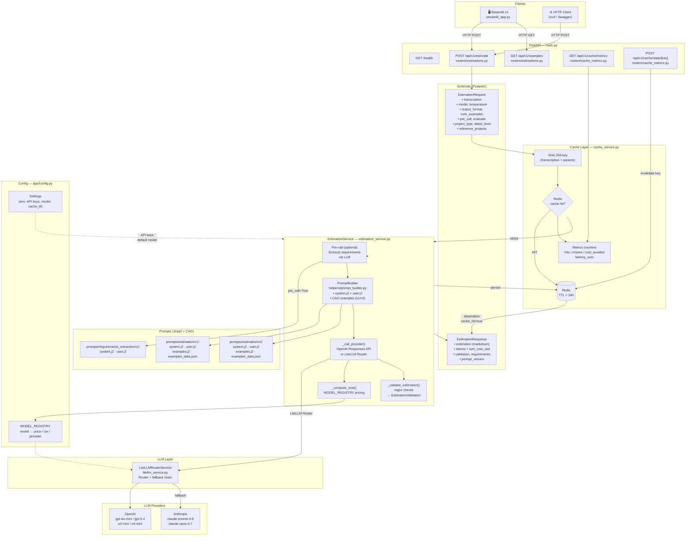

# AI Engine

REST API that generates software effort estimates from meeting transcriptions. Implements **Context-Augmented Generation (CAG)**: curated reference examples are injected into the system prompt to ensure the model always produces structured, consistent estimates.

---

## Overview

The AI Engine is the core intelligence layer of Estimator. It:

- 🧠 **Processes transcriptions** — Analyzes meeting notes to extract requirements
- 🎯 **Generates estimates** — Produces structured effort estimates with phases, costs, and confidence scores
- 📊 **Multi-model support** — Routes to OpenAI, Anthropic, or other LLM providers via LiteLLM
- ⚡ **Smart caching** — Redis-backed exact caching with 24h TTL
- 💰 **Cost tracking** — Per-call and session-level cost calculation
- 🔗 **Async processing** — ARQ worker for long-running estimations

---

## Architecture

### Data Flow

Every `POST /api/v1/estimate` request flows through three layers:

1. **Cache Layer** (`cache_service.py`)
   - Computes SHA-256 hash of all request parameters
   - Returns cached response immediately if found in Redis (zero LLM cost)
   - Stores response with 24-hour TTL on cache miss
   - Tracks hit/miss counters, cost-avoided totals, latency averages

2. **Estimation Service** (`estimation_service.py`)
   - Optional **pre-call**: Runs requirements extraction on raw transcription
   - **Prompt building**: Renders Jinja2 templates (v1 or v2) with CAG examples
   - **LLM dispatch**: Routes request through LiteLLM router with fallback chain
   - **Cost calculation**: Computes USD cost from `MODEL_REGISTRY` pricing
   - Optional **validation**: Regex checks and `EstimationValidation` score

3. **LLM Layer** (`llm/`)
   - LiteLLM router with primary model + Anthropic fallback
   - Normalizes responses (text, input/output tokens, response ID)
   - Handles provider-specific errors and retries

---

## Features

- ✅ **CAG Pipeline** — Curated examples in system prompt for consistent output
- ✅ **Typed Responses** — Validated `EstimationResult` with phases, costs, duration, confidence
- ✅ **Multi-Provider** — OpenAI, Anthropic via LiteLLM; switch models per-request
- ✅ **Redis Caching** — Identical requests served from cache without LLM calls
- ✅ **Token & Cost Tracking** — Input/output tokens and per-turn USD cost
- ✅ **Streamlit UI** — Web interface for ad-hoc estimations
- ✅ **ARQ Worker** — Async processing with callback to backend

---

## Project Structure

```
ai-engine/
├── app/
│   ├── __init__.py
│   ├── main.py                         # App factory, router registration
│   ├── config.py                       # Settings, MODEL_REGISTRY, logging
│   ├── worker.py                       # ARQ async worker
│   ├── routers/
│   │   ├── __init__.py
│   │   ├── estimations.py              # POST /api/v1/estimate, GET /api/v1/examples
│   │   ├── cache_metrics.py            # GET /api/v1/cache/metrics, POST /api/v1/cache/stale
│   │   └── internal.py                 # /health, internal endpoints
│   ├── services/
│   │   ├── __init__.py
│   │   ├── estimation_service.py       # Main orchestration + cost calc
│   │   ├── cache_service.py            # Redis caching logic
│   │   ├── litellm_service.py          # LiteLLM router + fallback
│   │   ├── metadata_extractor.py       # Session metadata extraction
│   │   └── helpers/
│   │       ├── prompt_builder.py       # Jinja2 template rendering
│   │       └── error_mapper.py         # LLM error normalization
│   ├── schemas/
│   │   ├── __init__.py
│   │   └── estimation.py               # EstimationRequest/Response
│   ├── guardrails/                     # Input validation & safety
│   │   ├── input.py
│   │   └── output.py
│   ├── cache/                          # Caching utilities
│   │   └── semantic.py
│   └── prompts/
│       ├── loader.py
│       ├── estimation/v1/              # system.j2, user.j2, examples.j2, examples_data.json
│       ├── estimation/v2/              # system.j2, user.j2, examples.j2, examples_data.json
│       └── requirements_extraction/v1/ # pre-call templates
├── tests/
│   ├── __init__.py
│   ├── conftest.py
│   ├── unit/                           # Unit tests
│   └── integration/                    # Integration tests
├── streamlit_app.py                    # Streamlit UI
├── main.py                             # Uvicorn entry point
├── requirements.txt                    # Dependencies
├── pyproject.toml                      # Project metadata
├── docker-compose.yml                  # Local stack (API + Redis)
└── Dockerfile                          # Production image
```

---

## API Endpoints

### Estimations

| Method | Path | Description |
|--------|------|-------------|
| `POST` | `/api/v1/estimate` | Generate sync estimation |
| `POST` | `/api/v1/estimate/structured` | Generate with structured output |
| `POST` | `/api/v1/internal/estimate/async` | Queue async estimation |
| `GET` | `/api/v1/examples` | List CAG reference examples |

### Cache

| Method | Path | Description |
|--------|------|-------------|
| `GET` | `/api/v1/cache/metrics` | Cache statistics (hits, misses, cost avoided) |
| `POST` | `/api/v1/cache/stale/{key}` | Invalidate cached entry |

### Health

| Method | Path | Description |
|--------|------|-------------|
| `GET` | `/health` | Health check |

---

## API Usage

### Sync Estimation

**Request:**
```bash
curl -X POST http://localhost:8001/api/v1/estimate \
  -H "Content-Type: application/json" \
  -d '{
    "transcription": "In the meeting we discussed building a mobile app with auth...",
    "model": "gpt-4o-mini",
    "temperature": 0.7,
    "max_output_tokens": 2048,
    "num_examples": 3,
    "project_type": "web_app",
    "detail_level": "detailed"
  }'
```

**Response:**
```json
{
  "estimation": "## Effort Estimate\n\n...",
  "structured": {
    "summary": "Mobile app with authentication and dashboard",
    "total_duration_weeks": 10,
    "total_cost_usd": 28000,
    "confidence_pct": 85,
    "phases": [
      {
        "name": "Design & Architecture",
        "duration_weeks": 2,
        "cost_usd": 5000,
        "confidence_pct": 90
      }
    ]
  },
  "model": "gpt-4o-mini",
  "input_tokens": 2150,
  "output_tokens": 340,
  "turn_cost_usd": 0.000425,
  "response_id": "chatcmpl-...",
  "cache_hit": false,
  "prompt_version": "v2"
}
```

---

## Supported Models

### OpenAI

| Model | Input $/M | Output $/M | Context | Reasoning |
|-------|-----------|-----------|---------|-----------|
| `gpt-4o-mini` | $0.15 | $0.60 | 128K | — |
| `gpt-5.4-mini` | $0.75 | $4.50 | 128K | — |
| `gpt-5.4` | $2.50 | $15.00 | 128K | — |
| `o3-mini` | $1.10 | $4.40 | 200K | ✅ Yes |
| `o4-mini` | $1.10 | $4.40 | 200K | ✅ Yes |

### Anthropic

| Model | Input $/M | Output $/M | Context | Reasoning |
|-------|-----------|-----------|---------|-----------|
| `claude-haiku-4-5` | $0.80 | $4.00 | 200K | — |
| `claude-sonnet-4-6` | $3.00 | $15.00 | 200K | — |
| `claude-opus-4-7` | $15.00 | $75.00 | 200K | ✅ Yes |

All models are defined in `app/config.py` under `MODEL_REGISTRY`. Add a new model with one line.

---

## Setup

### 1. Environment Variables

Create `.env` in `ai-engine/`:

```env
# LLM Providers
OPENAI_API_KEY=sk-...
ANTHROPIC_API_KEY=sk-ant-...

# Default model
LLM_MODEL=gpt-4o-mini

# Cache
CACHE_ENABLED=true
CACHE_TTL_HOURS=24
REDIS_URL=redis://localhost:6379/0

# Security
INTERNAL_API_KEY=your-secret-key

# Logging
LOG_LEVEL=INFO
```

### 2. Run with Docker Compose

```bash
cd ai-engine
docker compose up --build
```

This starts:
- FastAPI API on http://localhost:8001
- Redis on localhost:6379

Interactive API docs: http://localhost:8001/docs

### 3. Run Streamlit UI

Runs outside Docker to avoid WebSocket issues on Windows/Mac.

```bash
cd ai-engine
uv sync
uv run streamlit run streamlit_app.py
```

Streamlit UI: http://localhost:8501

### 4. Local Development (no Docker)

```bash
cd ai-engine
uv sync
uv run python main.py              # API at http://localhost:8001
uv run streamlit run streamlit_app.py  # UI at http://localhost:8501
```

---

## Development

### Running Tests

```bash
cd ai-engine

# All tests
uv run pytest tests/ -v

# Unit tests only
uv run pytest tests/unit/ -v

# Integration tests only
uv run pytest tests/integration/ -v

# Specific test file
uv run pytest tests/unit/test_estimation_service.py -v

# With coverage
uv run pytest tests/ --cov=app --cov-report=html
```

### Adding a New Model

Edit `app/config.py`:

```python
MODEL_REGISTRY: dict[str, ModelConfig] = {
    # ... existing models ...
    "my-new-model": ModelConfig(
        name="my-new-model",
        input_price_per_m_tokens=1.00,
        output_price_per_m_tokens=5.00,
        context_window=128_000,
        provider="openai",  # or "anthropic"
        reasoning=False
    ),
}
```

The API and UI automatically pick up the new model.

### Modifying Prompts

Prompts are Jinja2 templates in `app/prompts/`. Two versions are available:

- **v1**: Original CAG format
- **v2**: Enhanced version with improved structure

Edit `system.j2` or `user.j2`, then test:

```bash
uv run python -c "
from app.services.helpers.prompt_builder import PromptBuilder
from app.schemas.estimation import EstimationRequest

builder = PromptBuilder()
request = EstimationRequest(transcription='test', prompt_version='v2')
prompts = builder.build(request)
print(prompts['system'][:200])
"
```

---

## Stack

| Component | Version | Purpose |
|---|---|---|
| Python | 3.12 | Language |
| FastAPI | 0.104+ | Web framework |
| LiteLLM | 1.0+ | LLM routing |
| Redis | 7.0+ | Caching |
| ARQ | 0.25+ | Async jobs |
| Jinja2 | 3.1+ | Prompt templating |
| Pydantic | 2.0+ | Data validation |
| Streamlit | 1.28+ | Web UI |
| pytest | 7.4+ | Testing |

---

## Design Decisions

### Heuristic vs. LLM Metadata Extraction

After each estimation, session metadata (project name, tech stack, team size) is extracted and injected into subsequent prompts as context.

**Two approaches considered:**

| | Heuristic | LLM Extractor |
|---|---|---|
| Latency | < 1 ms | +0.5–1 s/turn |
| Cost | Zero | 1 extra call/turn |
| Accuracy | Good for narrow fields | Better for ambiguous data |
| Failure mode | Silent (field = `None`) | API error blocks turn |

**Decision: Heuristic** (`app/services/metadata_extractor.py`)

Reasoning:
- Fields are narrow and predictable (title patterns, ~70-keyword allow-list for tech)
- False positives are low-risk (metadata is advisory, not user-facing)
- Latency/cost savings are significant
- Interface is stable — `LLMMetadataExtractor` can be swapped in later

---

## Performance & Monitoring

### Cache Metrics

```bash
curl http://localhost:8001/api/v1/cache/metrics
```

Response includes:
- Cache hits / misses
- Total cost avoided
- Average latency (cached vs. uncached)
- Memory usage

### Profiling

Enable Prometheus metrics (optional):

```bash
# In app/main.py, add:
from prometheus_client import Counter

estimate_counter = Counter('estimates_total', 'Total estimates', ['model', 'status'])
```

---

## Troubleshooting

### Redis Connection Failed

Ensure Redis is running:

```bash
# Docker
docker compose up redis

# Local
redis-server
```

Check connection:

```bash
redis-cli ping  # Should return PONG
```

### LLM Rate Limit (429)

- Check API key validity
- Implement exponential backoff in caller
- Reduce `temperature` to speed up generation

### Memory Leak on Long Cache

Check Redis memory:

```bash
redis-cli info memory
```

Clear old cache entries:

```bash
redis-cli FLUSHDB  # Caution: clears all data
```

Set memory limit in Redis config:

```
maxmemory 512mb
maxmemory-policy allkeys-lru
```

---

## Related Documentation

- [Main README](../README.md) — Project overview
- [Backend README](../backend/README.md) — Business API
- [Frontend README](../frontend/README.md) — Angular UI
- [LiteLLM Docs](https://docs.litellm.ai) — Multi-provider LLM routing

---

## License

MIT


## Architecture

### Data flow diagram



### How it works

Every `POST /api/v1/estimate` request flows through three layers:

1. **Cache layer** (`cache_service.py`) — A SHA-256 hash of all request parameters is computed. If a matching key exists in Redis the response is returned immediately with `cache_hit=true` and zero LLM cost. On a miss, the request continues and the final response is stored in Redis with a 24-hour TTL. Hit/miss counters, cost-avoided totals, and latency averages are tracked as Redis counters and exposed via `GET /api/v1/cache/metrics`.

2. **Estimation service** (`estimation_service.py`) — Orchestrates the full pipeline:
   - *(Optional)* A **pre-call** (`pre_call=true`) sends the raw transcription through a requirements-extraction prompt to produce a cleaner, structured input before the main call.
   - **`PromptBuilder`** renders the Jinja2 system and user templates (v1 or v2) and injects the configured number of CAG few-shot examples.
   - **`_call_provider()`** dispatches all requests through `LiteLLMRouterService` (`litellm_service.py`), which uses a LiteLLM Router with a primary OpenAI model and an automatic Anthropic fallback chain.
   - **`_compute_cost()`** calculates the USD cost from `MODEL_REGISTRY` pricing.
   - *(Optional)* **`_validate_estimation()`** runs regex checks on the output and returns a structured `EstimationValidation` score.

3. **LLM layer** (`llm/openai.py`, `llm/litellm.py`) — Thin provider wrappers that normalize the response format (text, input/output tokens, response ID) for the service layer. The LiteLLM router supports a primary model with a configurable fallback chain.

All supported models and their pricing are declared in `MODEL_REGISTRY` inside `app/config.py` — a single source of truth used by both the API and the Streamlit UI.

## Features

- **CAG pipeline** — static estimation examples in the system prompt; the model always returns a coherent, structured output.
- **Typed responses** — every estimation is returned as a validated `EstimationResult` object (phases, costs, duration, confidence).
- **Multi-provider support** — OpenAI and Anthropic via LiteLLM; switch models per-request without restarting the server.
- **Redis cache** — identical requests are served from cache without calling the LLM.
- **Token and cost tracking** — every response includes input/output token counts and per-turn USD cost.
- **Streamlit UI** — web interface to paste transcriptions and receive structured estimates without writing code.

## Project structure

```
ai-engine/
├── app/
│   ├── config.py                         # Settings + MODEL_REGISTRY
│   ├── routers/
│   │   ├── estimations.py                # POST /estimate, GET /examples
│   │   └── cache_metrics.py             # GET /cache/metrics, POST /cache/stale
│   ├── services/
│   │   ├── estimation_service.py         # Main orchestration + cost calc
│   │   ├── cache_service.py              # Redis caching decorator
│   │   ├── litellm_service.py            # LiteLLM Router + fallback chain
│   │   └── helpers/
│   │       ├── prompt_builder.py         # Jinja2 template renderer
│   │       └── error_mapper.py           # LLM error normalisation
│   ├── schemas/
│   │   └── estimation.py                 # EstimationRequest / EstimationResponse
│   └── prompts/
│       ├── estimation/v1/                # system.j2, user.j2, examples (v1)
│       ├── estimation/v2/                # system.j2, user.j2, examples (v2)
│       └── requirements_extraction/v1/   # pre-call prompt templates
├── tests/                                # Unit and integration tests
├── streamlit_app.py                      # Streamlit UI entry point
├── docker-compose.yml                    # API + Redis
├── main.py                               # Uvicorn entry point
└── pyproject.toml
```

## API

| Method | Path | Description |
|--------|------|-------------|
| `GET` | `/health` | Health check |
| `GET` | `/api/v1/examples` | Returns the CAG reference examples loaded into the prompt |
| `POST` | `/api/v1/estimate` | Generates a structured effort estimate |

### `POST /api/v1/estimate`

**Request body**

```json
{
  "transcription": "<meeting transcription or project description>",
  "model": "gpt-4o-mini",
  "temperature": 0.7,
  "max_output_tokens": 2048
}
```

**Response body**

```json
{
  "result": {
    "summary": "Mobile app with authentication and dashboard",
    "total_duration_weeks": 10,
    "total_cost_eur": 28000,
    "confidence_pct": 80,
    "phases": [
      {
        "name": "Design & Architecture",
        "duration_weeks": 2,
        "cost_eur": 5000,
        "confidence_pct": 90,
        "assumptions": ["Figma mockups provided"]
      }
    ]
  },
  "model": "gpt-4o-mini",
  "input_tokens": 620,
  "output_tokens": 310,
  "turn_cost_usd": 0.000279,
  "response_id": "chatcmpl-...",
  "prompt_version": "v1"
}
```

**Error responses**

| Status | Condition |
|--------|-----------|
| `401` | Invalid or missing API key |
| `413` | Estimated prompt exceeds the model context window |
| `422` | `transcription` field missing or too short |
| `429` | LLM provider rate limit exceeded |
| `500` | LLM provider returned an unexpected error |

## Setup

### 1. Configure environment variables

Create a `.env` file inside `ai-engine/`:

```env
OPENAI_API_KEY=sk-...
# ANTHROPIC_API_KEY=sk-ant-...   # uncomment to enable Anthropic models

# Default model (must be a key in MODEL_REGISTRY)
LLM_MODEL=gpt-4o-mini

# Redis cache (optional)
CACHE_ENABLED=false
```

### 2. Run with Docker Compose

```bash
cd ai-engine
docker compose up --build
```

This starts the FastAPI backend and a Redis container.

- **API + interactive docs**: http://localhost:8000/docs

### 3. Run the Streamlit UI locally

Streamlit runs outside Docker to avoid WebSocket issues with Docker Desktop on Windows.

Requires Python 3.11+ and [uv](https://docs.astral.sh/uv/).

```bash
cd ai-engine
uv sync
uv run streamlit run streamlit_app.py        # UI at http://localhost:8501
```

### Local execution (without Docker)

```bash
cd ai-engine
uv sync
uv run python main.py                        # API at http://localhost:8000
uv run streamlit run streamlit_app.py        # UI  at http://localhost:8501
```

## Adding or updating models

All supported models are declared in `app/config.py`:

```python
MODEL_REGISTRY: dict[str, ModelConfig] = {
    # OpenAI
    "gpt-4o-mini":        ModelConfig("gpt-4o-mini",        0.15,  0.60, 128_000, "openai"),
    "gpt-5.4-mini":       ModelConfig("gpt-5.4-mini",       0.75,  4.50, 128_000, "openai"),
    "gpt-5.4":            ModelConfig("gpt-5.4",            2.50, 15.00, 128_000, "openai"),
    "o3-mini":            ModelConfig("o3-mini",             1.10,  4.40, 200_000, "openai", reasoning=True),
    "o4-mini":            ModelConfig("o4-mini",             1.10,  4.40, 200_000, "openai", reasoning=True),
    # Anthropic — litellm_model must include the "anthropic/" prefix
    "claude-sonnet-4-6":  ModelConfig("anthropic/claude-sonnet-4-6",  3.00, 15.00, 200_000, "anthropic"),
    "claude-opus-4-7":    ModelConfig("anthropic/claude-opus-4-7",   15.00, 75.00, 200_000, "anthropic", reasoning=True),
    # ...
}
```

Each entry specifies the LiteLLM model string, input/output price per million tokens, context window, provider, and whether the model supports reasoning. Adding a new model requires only one line here — the API and UI pick it up automatically.

## Design decisions

### Session metadata extraction: heuristic vs. LLM extractor

After each estimation turn the service enriches a `ProjectMetadata` object
(project name, tech stack, team size, agreed scope) that is injected into the
`<project_metadata>` block of the system prompt on every subsequent call.

Two strategies were considered for populating this object:

| | Heuristic | LLM extractor |
|---|---|---|
| **Latency overhead** | < 1 ms (regex, no I/O) | +0.5–1 s per turn |
| **Cost overhead** | zero | one extra LLM call per turn |
| **Accuracy** | good for narrow, well-defined fields | better for ambiguous names/scope |
| **Failure mode** | field stays `None` silently | API error blocks the turn |

**Decision: heuristic** (`app/services/metadata_extractor.py`).

The fields are narrow and predictable enough for a regex/allow-list approach:
`project_name` is matched by title-phrase patterns; `mentioned_technologies` is
scanned against a curated ~70-keyword allow-list; `assumed_team_size` is extracted
from numeric patterns in the LLM response; `agreed_scope` is the first sentence(s)
of the transcript. False positives are low-risk — the metadata is advisory context
for the LLM, not user-facing output. The `MetadataExtractor.update()` interface is
stable, so a `LLMMetadataExtractor` can be swapped in without touching the router.

## Tests

```bash
uv run pytest tests/ -v
```
