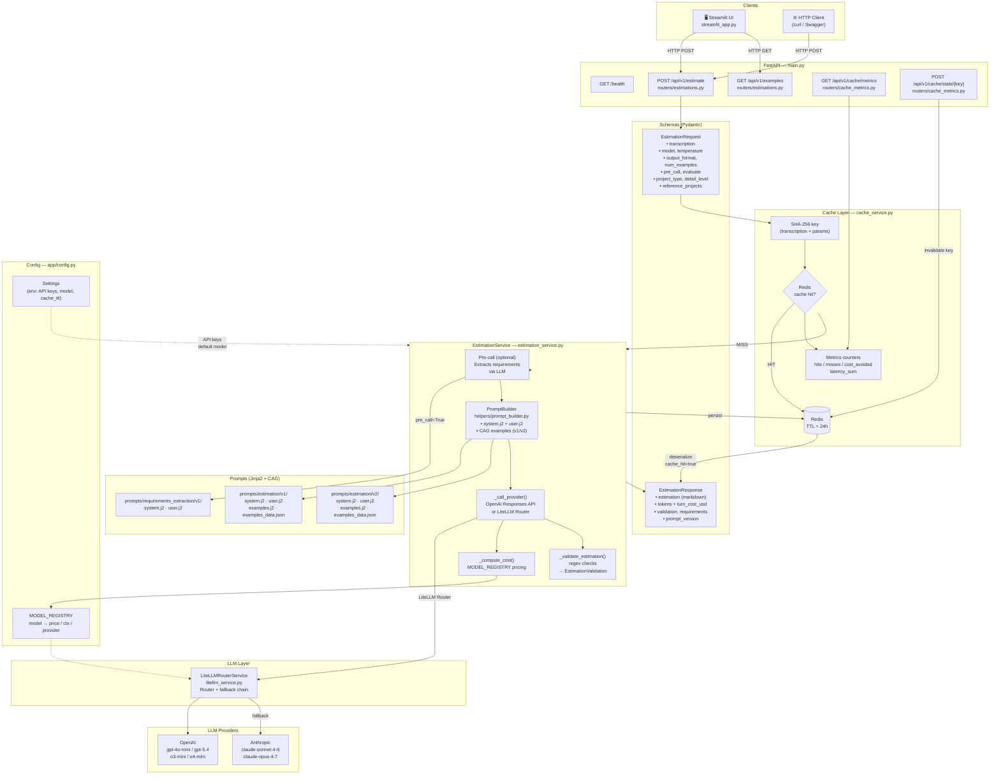

# AI Engine

REST API that generates software effort estimates from meeting transcriptions. Implements **Context-Augmented Generation (CAG)**: curated reference examples are injected into the system prompt to ensure the model always produces structured, consistent estimates.

---

## Overview

The AI Engine is the core intelligence layer of Estimator. It:

- 🧠 **Processes transcriptions** — Analyzes meeting notes to extract requirements
- 🎯 **Generates estimates** — Produces structured effort estimates with phases, costs, and confidence scores
- 📊 **Multi-model support** — Routes to OpenAI, Anthropic, or other LLM providers via LiteLLM
- ⚡ **Smart caching** — Redis-backed exact caching with 24h TTL
- 💰 **Cost tracking** — Per-call and session-level cost calculation
- 🔗 **Async processing** — ARQ worker for long-running estimations

---

## Architecture

### Data Flow

Every `POST /api/v1/estimate` request flows through three layers:

1. **Cache Layer** (`cache_service.py`)
   - Computes SHA-256 hash of all request parameters
   - Returns cached response immediately if found in Redis (zero LLM cost)
   - Stores response with 24-hour TTL on cache miss
   - Tracks hit/miss counters, cost-avoided totals, latency averages

2. **Estimation Service** (`estimation_service.py`)
   - Optional **pre-call**: Runs requirements extraction on raw transcription
   - **Prompt building**: Renders Jinja2 templates (v1 or v2) with CAG examples
   - **LLM dispatch**: Routes request through LiteLLM router with fallback chain
   - **Cost calculation**: Computes USD cost from `MODEL_REGISTRY` pricing
   - Optional **validation**: Regex checks and `EstimationValidation` score

3. **LLM Layer** (`llm/`)
   - LiteLLM router with primary model + Anthropic fallback
   - Normalizes responses (text, input/output tokens, response ID)
   - Handles provider-specific errors and retries

---

## Features

- ✅ **CAG Pipeline** — Curated examples in system prompt for consistent output
- ✅ **Tier-Based Adaptive Prompts** — Developer / PM / Executive audiences get distinct system prompts from JWT claim
- ✅ **Typed Responses** — Validated `EstimationResult` with phases, costs, duration, confidence
- ✅ **Multi-Provider** — OpenAI, Anthropic via LiteLLM; switch models per-request
- ✅ **Redis Caching** — Identical requests served from cache without LLM calls
- ✅ **Token & Cost Tracking** — Input/output tokens and per-turn USD cost
- ✅ **Streamlit UI** — Web interface for ad-hoc estimations
- ✅ **ARQ Worker** — Async processing with callback to backend
- ✅ **Conversational Sessions** — In-memory sliding window (6 turns) with project metadata extraction
- ✅ **Critical Information Anchors** — Heuristic detection of metadata, decisions, risks, scope changes per turn
- ✅ **Accumulative Summarizer** — Grows contextual summary across conversation turns

---

## Project Structure

```
ai-engine/
├── app/
│   ├── __init__.py
│   ├── main.py                         # App factory, router registration
│   ├── config.py                       # Settings, MODEL_REGISTRY, logging
│   ├── worker.py                       # ARQ async worker
│   ├── routers/
│   │   ├── __init__.py
│   │   ├── estimations.py              # POST /api/v1/estimate, GET /api/v1/examples
│   │   ├── cache_metrics.py            # GET /api/v1/cache/metrics, POST /api/v1/cache/stale
│   │   └── internal.py                 # /health, internal endpoints
│   ├── services/
│   │   ├── __init__.py
│   │   ├── estimation_service.py       # Main orchestration + cost calc
│   │   ├── cache_service.py            # Redis caching logic
│   │   ├── litellm_service.py          # LiteLLM router + fallback
│   │   ├── sessions.py                 # In-memory session store + ConversationHistory
│   │   ├── metadata_extractor.py       # Session metadata extraction
│   │   ├── summarizer_service.py       # Accumulative summary + anchor generation
│   │   ├── attachment_service.py       # PDF/DOCX text extraction
│   │   └── helpers/
│   │       ├── prompt_builder.py       # Jinja2 template rendering
│   │       ├── error_mapper.py         # LLM error normalization
│   │       └── cost_calculator.py      # Token & cost utilities
│   ├── schemas/
│   │   ├── __init__.py
│   │   └── estimation.py               # EstimationRequest/Response
│   ├── guardrails/                     # Input validation & safety
│   │   ├── input.py
│   │   └── output.py
│   ├── cache/                          # Caching utilities
│   │   └── semantic.py
   ├── dependencies.py                 # get_request_tier() — extracts UserTier from JWT
   └── prompts/
       ├── loader.py
       ├── estimation/
       │   ├── developer/
       │   │   ├── v1/                 # system.j2, user.j2, examples.j2, examples_data.json (3 examples)
       │   │   └── v2/                 # enhanced version + Confidence Level (1 example)
       │   ├── pm/
       │   │   ├── v1/                 # milestone-oriented prompt (2 examples)
       │   │   └── v2/                 # + Confidence Level
       │   └── executive/
       │       ├── v1/                 # ROI/investment-focused prompt (2 examples)
       │       └── v2/                 # + Confidence Level
│       └── requirements_extraction/v1/ # pre-call templates
├── tests/
│   ├── __init__.py
│   ├── conftest.py
│   ├── unit/                           # Unit tests
│   └── integration/                    # Integration tests
├── streamlit_app.py                    # Streamlit UI
├── main.py                             # Uvicorn entry point
├── requirements.txt                    # Dependencies
├── pyproject.toml                      # Project metadata
├── docker-compose.yml                  # Local stack (API + Redis)
└── Dockerfile                          # Production image
```

---

## Tier-Based Adaptive Prompts

Every estimation request uses a **system prompt tailored to the caller's role**. The tier is read from the `tier` claim of the Bearer JWT — it is never accepted as a body parameter.

| Tier | Audience | Prompt focus |
|------|----------|--------------|
| `developer` | Engineers & architects | Technical breakdown — tasks, roles, subtasks, risks |
| `pm` | Project managers | Milestone-oriented — phases, dependencies, timeline |
| `executive` | Stakeholders | ROI / investment summary — cost, value, strategic risks |

### How it works

```
JWT (backend login)
  └─ tier claim ──► get_request_tier() ──► TierDep ──► PromptBuilder
                                                              │
                             estimation/{tier}/v{n}/system.j2 ◄─┘
```

1. **Backend** embeds `tier` into the access token at login (`create_access_token(user_id, tier)`).
2. **AI engine** extracts it via `get_request_tier()` (`app/dependencies.py`) — invalid or missing tokens fall back to `developer`.
3. **`PromptBuilder`** resolves `prompts/estimation/{tier}/{version}/system.j2` and injects the matching CAG examples.
4. The same `EstimationRequest` schema is used for all tiers — the response format (`EstimationResult`, `EstimationResponse`) does not change.

### Security principle — tier never from client body

`EstimationRequest` has **no `tier` field**. Injecting `"tier": "executive"` in the JSON body is rejected (422) or silently ignored. The only trusted source is the signed JWT.

---

## API Endpoints

### Estimations

| Method | Path | Description |
|--------|------|-------------|
| `POST` | `/api/v1/estimate` | Generate sync estimation |
| `POST` | `/api/v1/estimate/structured` | Generate with structured output |
| `POST` | `/api/v1/internal/estimate/async` | Queue async estimation |
| `GET` | `/api/v1/examples` | List CAG reference examples |

### Sessions (Conversational)

| Method | Path | Description |
|--------|------|-------------|
| `POST` | `/sessions` | Create new conversation session |
| `GET` | `/sessions` | List all active sessions |
| `GET` | `/sessions/{session_id}` | Get session state (history, metadata, anchors) |
| `POST` | `/sessions/{session_id}/estimate` | Run estimation for session (with attachments) |

### Cache

| Method | Path | Description |
|--------|------|-------------|
| `GET` | `/api/v1/cache/metrics` | Cache statistics (hits, misses, cost avoided) |
| `POST` | `/api/v1/cache/stale/{key}` | Invalidate cached entry |

### Health

| Method | Path | Description |
|--------|------|-------------|
| `GET` | `/health` | Health check |

---

## API Usage

### Sync Estimation

The `Authorization` header carries the JWT issued by the backend. The `tier` claim inside it selects the system prompt automatically.

**Request:**
```bash
curl -X POST http://localhost:8001/api/v1/estimate \
  -H "Content-Type: application/json" \
  -H "Authorization: Bearer <access_token>" \
  -d '{
    "transcription": "In the meeting we discussed building a mobile app with auth...",
    "model": "gpt-4o-mini",
    "temperature": 0.7,
    "max_output_tokens": 2048,
    "num_examples": 3,
    "project_type": "web_app",
    "detail_level": "detailed"
  }'
```

---

## Session 06 Smoke

Use these commands to verify ingestion + persistence migration pieces:

```bash
# 1) Validate local setup and seed corpus
python scripts/preflight_s06.py

# 2) Run cleaning demo over budgets
python scripts/demo_cleaning_s06.py

# 3) Run PII pseudonymization demo over transcripts
python scripts/demo_pii_s06.py
```

If `preflight_s06.py` fails on missing packages, install from `pyproject.toml` / `requirements.txt` first.

## Semantic Search Demo

Run representative semantic queries against the persisted corpus:

```bash
docker compose run --rm ai-engine python query_examples.py --base-url http://ai-engine:8001
```

The repository includes a root-level compatibility entrypoint (`query_examples.py`) that delegates to `scripts/query_examples.py`, so the command works without passing script subpaths.

## Hybrid Search and Reranking Runbook

Use these commands to reproduce the hybrid retrieval and reranking exercise against the seeded budget corpus.

1. Apply the database migration for the lexical search column and index:

```bash
alembic upgrade head
```

2. Install the optional reranker dependency if you want to run the reranked configurations:

```bash
uv add sentence-transformers
```

3. Verify the reranker can load and score before running reranked evaluations:

```bash
uv run python -m app.generation.rag.verify_reranker
```

4. Start the services and ingest the budgets. From the repository root:

```bash
docker compose up -d postgres redis ai-engine
docker compose exec ai-engine alembic upgrade head
docker compose exec ai-engine python scripts/ingest_budgets_batch.py --base-url http://ai-engine:8001
```

5. Run the evaluation script from the ai-engine directory to compare the four required configurations:

```bash
python scripts/eval_hybrid_rerank.py --base-url http://ai-engine:8001
```

Runtime retrieval defaults can be changed without restart via:

- `GET /api/v1/config/retrieval`
- `PUT /api/v1/config/retrieval`

The script evaluates these configurations over the 5-query golden set:

| Configuration | Search mode | Reranking |
|---|---|---|
| A | vector | No |
| B | hybrid | No |
| C | vector | Yes |
| D | hybrid | Yes |

The output is a markdown table with Precision@5 and mean latency in milliseconds for each configuration.

6. Run the generation-quality evaluation with RAGAS over the golden set:

```bash
uv sync --extra evals
python scripts/eval_ragas_generation.py --base-url http://ai-engine:8001 --rerank
```

The script calls the full `/api/v1/rag/estimate` pipeline and reports:

- Answer Relevancy
- Faithfulness
- Context Precision
- Context Recall
- Grounded vs. ungrounded line items
- Dangling line-level citation references detected after validation

The baseline input set is `tests/evals/hybrid_rerank_golden_set.json`, extended with `ground_truth` for each of the 5 queries.

---

## Text Similarity Tool

The `scripts/compare.py` script calculates **cosine similarity** between two text embeddings using the `OpenAIEmbedder` class. Useful for validating semantic relationships between texts without importing numpy or scikit-learn.

### Usage

**Inside Docker container:**
```bash
docker compose exec servicio_ia python scripts/compare.py \
  --text-a "OAuth 2.0 authentication backend for fintech" \
  --text-b "JWT-based authorization service for banking app"
```

**Outside Docker (with uv and .env loaded):**
```bash
cd ai-engine
uv run python scripts/compare.py \
  --text-a "OAuth 2.0 authentication backend for fintech" \
  --text-b "JWT-based authorization service for banking app"
```

### Output

```
Text A: OAuth 2.0 authentication backend for fintech
Text B: JWT-based authorization service for banking app
Cosine similarity: 0.8421
```

**Details:**
- Embeddings generated using `text-embedding-3-small` (OpenAI)
- Cosine similarity computed manually: `(a·b) / (||a|| × ||b||)`
- Range: `[0, 1]` for normalized embeddings (0 = orthogonal, 1 = identical)
- Requires `OPENAI_API_KEY` environment variable

---

## Embedding Inspection Tool

The `scripts/inspect_embedding.py` script generates a single embedding and prints key diagnostics:

- Model used
- Vector dimensions
- First and last 5 values
- Python value type (`float`)

### Usage

**Inside Docker container:**
```bash
docker compose exec servicio_ia python scripts/inspect_embedding.py \
  --text "OAuth 2.0 authentication backend with JWT tokens for fintech mobile app"
```

**Outside Docker (with uv and .env loaded):**
```bash
cd ai-engine
uv run python scripts/inspect_embedding.py \
  --text "OAuth 2.0 authentication backend with JWT tokens for fintech mobile app"
```

To test with another embedding model:
```bash
uv run python scripts/inspect_embedding.py --model text-embedding-3-large
```

---

## Dependency Installation Guide

### Local virtualenv (pip)

Use this when running the service outside dev containers (for example on Windows):

```bash
cd ai-engine
python -m venv .venv
# PowerShell
.\.venv\Scripts\Activate.ps1
python -m pip install -U pip
python -m pip install -r requirements.txt
```

`requirements.txt` includes Session 06 ingestion extras (`pandera`, `openpyxl`) and Python-version-aware markers for Presidio packages.

### Dev container / Codespaces

In dev containers we use `uv sync` from `pyproject.toml` (not `pip install -r requirements.txt`).

Detailed flow and scripts are documented in:

- `../.devcontainer/README.md`

**Response:**
```json
{
  "estimation": "## Effort Estimate\n\n...",
  "structured": {
    "summary": "Mobile app with authentication and dashboard",
    "total_duration_weeks": 10,
    "total_cost_usd": 28000,
    "confidence_pct": 85,
    "phases": [
      {
        "name": "Design & Architecture",
        "duration_weeks": 2,
        "cost_usd": 5000,
        "confidence_pct": 90
      }
    ]
  },
  "model": "gpt-4o-mini",
  "input_tokens": 2150,
  "output_tokens": 340,
  "turn_cost_usd": 0.000425,
  "response_id": "chatcmpl-...",
  "cache_hit": false,
  "prompt_version": "v2"
}
```

---

## Supported Models

### OpenAI

| Model | Input $/M | Output $/M | Context | Reasoning |
|-------|-----------|-----------|---------|-----------|
| `gpt-4o-mini` | $0.15 | $0.60 | 128K | — |
| `gpt-5.4-mini` | $0.75 | $4.50 | 128K | — |
| `gpt-5.4` | $2.50 | $15.00 | 128K | — |
| `o3-mini` | $1.10 | $4.40 | 200K | ✅ Yes |
| `o4-mini` | $1.10 | $4.40 | 200K | ✅ Yes |

### Anthropic

| Model | Input $/M | Output $/M | Context | Reasoning |
|-------|-----------|-----------|---------|-----------|
| `claude-haiku-4-5` | $0.80 | $4.00 | 200K | — |
| `claude-sonnet-4-6` | $3.00 | $15.00 | 200K | — |
| `claude-opus-4-7` | $15.00 | $75.00 | 200K | ✅ Yes |

All models are defined in `app/config.py` under `MODEL_REGISTRY`. Add a new model with one line.

---

## Setup

### 1. Environment Variables

Create `.env` in `ai-engine/`:

```env
# LLM Providers
OPENAI_API_KEY=sk-...
ANTHROPIC_API_KEY=sk-ant-...

# Default model
LLM_MODEL=gpt-4o-mini

# Cache
CACHE_ENABLED=true
CACHE_TTL_HOURS=24
REDIS_URL=redis://localhost:6379/0

# Security
INTERNAL_API_KEY=your-secret-key

# Logging
LOG_LEVEL=INFO
```

### 2. Run with Docker Compose

```bash
cd ai-engine
docker compose up --build
```

This starts:
- FastAPI API on http://localhost:8001
- Redis on localhost:6379

Interactive API docs: http://localhost:8001/docs

### 3. Run Streamlit UI

Runs outside Docker to avoid WebSocket issues on Windows/Mac.

```bash
cd ai-engine
uv sync
uv run streamlit run streamlit_app.py
```

Streamlit UI: http://localhost:8501

### 4. Local Development (no Docker)

```bash
cd ai-engine
uv sync
uv run python main.py              # API at http://localhost:8001
uv run streamlit run streamlit_app.py  # UI at http://localhost:8501
```

---

## Development

### Running Tests

The test suite is organised into **three families** following the LLM testing pyramid:

| Family | Location | LLM calls | When to run |
|--------|----------|-----------|-------------|
| **1 — Hard determinism** | `tests/unit/`, `tests/integration/` | None (all mocked) | Every commit, local and CI |
| **2 — Soft determinism** | `tests/eval/test_soft_determinism.py` | Real (N runs per golden) | Pre-merge in CI |
| **3 — LLM-as-judge** | `tests/eval/test_llm_judge.py` | Real (2 calls per case) | Pre-merge in CI |

Families 2 and 3 are gated behind two pytest marks — `slow` and `llm_live` — and require valid API keys in the environment.

```bash
cd ai-engine

# ── Family 1 — Hard determinism (fast, no API keys needed) ──────────────────

# All hard tests (unit + integration)
uv run pytest tests/unit/ tests/integration/ -v

# Unit tests only
uv run pytest tests/unit/ -v

# Integration tests only
uv run pytest tests/integration/ -v

# Explicit exclusion of slow tests (same result, useful in scripts)
uv run pytest tests/ -m "not slow" -v

# Specific file
uv run pytest tests/unit/test_output_validator.py -v

# With coverage report
uv run pytest tests/unit/ tests/integration/ --cov=app --cov-report=html


# ── Family 2 — Soft determinism (requires API keys, ~9 LLM calls) ───────────

uv run pytest tests/eval/test_soft_determinism.py -m "slow and llm_live" -v


# ── Family 3 — LLM-as-judge via DeepEval GEval (~12 LLM calls) ──────────────

uv run pytest tests/eval/test_llm_judge.py -m "slow and llm_live" -v


# ── All three families together (full eval suite, pre-merge) ─────────────────

uv run pytest tests/ -m "slow and llm_live" -v
```

#### Golden dataset

Eval tests are parametrized against a curated golden dataset defined in `tests/eval/golden_dataset.py`. It contains five cases covering the full input spectrum:

| ID | Category | Expected hours |
|----|----------|---------------|
| `small_landing_page` | Small project | 16–120 h |
| `medium_admin_portal` | Medium project (uses `short_transcription.txt`) | 160–400 h |
| `large_reservation_system` | Large project with external integrations | 600–2 000 h |
| `ambiguous_internal_tool` | Ambiguous scope | 40–800 h |
| `contradictory_scope` | Edge case — scope vs. timeline mismatch | 400–3 000 h |

Families 2 and 3 run only on the first three goldens to control API cost.

### Adding a New Model

Edit `app/config.py`:

```python
MODEL_REGISTRY: dict[str, ModelConfig] = {
    # ... existing models ...
    "my-new-model": ModelConfig(
        name="my-new-model",
        input_price_per_m_tokens=1.00,
        output_price_per_m_tokens=5.00,
        context_window=128_000,
        provider="openai",  # or "anthropic"
        reasoning=False
    ),
}
```

The API and UI automatically pick up the new model.

### Modifying Prompts

Prompts are Jinja2 templates in `app/prompts/estimation/{tier}/{version}/`. Each tier (`developer`, `pm`, `executive`) contains two versions:

- **v1**: Standard CAG format with curated examples
- **v2**: Enhanced version adding Confidence Level and numbered estimation rules

Edit `system.j2` or `user.j2` inside the relevant tier folder, then test:

```bash
uv run python -c "
from app.services.helpers.prompt_builder import PromptBuilder
from app.schemas.estimation import EstimationRequest, UserTier

request = EstimationRequest(transcription='test transcription')

for tier in UserTier:
    builder = PromptBuilder(request, model_cfg=None, version='v1', tier=tier)
    system, _ = builder.render()
    print(f'{tier.value}: {system[:80]}...')
"
```

---

## Stack

| Component | Version | Purpose |
|---|---|---|
| Python | 3.12 | Language |
| FastAPI | 0.104+ | Web framework |
| LiteLLM | 1.0+ | LLM routing |
| Redis | 7.0+ | Caching |
| ARQ | 0.25+ | Async jobs |
| Jinja2 | 3.1+ | Prompt templating |
| Pydantic | 2.0+ | Data validation |
| Streamlit | 1.28+ | Web UI |
| pytest | 7.4+ | Testing |

---

## Design Decisions

### Persistence Schema Rationale

The semantic retrieval baseline uses PostgreSQL + pgvector with a two-table relational design.

- Two tables (`documents` and `chunks`) instead of one: one budget document produces N chunks. Splitting avoids duplicating document-level metadata per chunk and preserves referential integrity. `ON DELETE CASCADE` ensures deleting one document removes all dependent chunks automatically.
- `metadata JSONB` in both tables: stable fields stay as typed columns (`document_type`, `chunk_type`, timestamps), while variable enrichment attributes live in JSONB (tags, scope, technologies). This reduces schema churn while keeping query flexibility.
- GIN index on `chunks.metadata`: supports key-based JSONB filters efficiently when needed.
- `vector(1536)` for embeddings: fixed dimension aligned with `text-embedding-3-small`. Changing dimensions implies re-embedding the full corpus, so this is intentionally explicit in schema.
- `embedding` is nullable: allows future async ingestion flows where chunk rows are inserted first and vectors are backfilled later. In the current flow, chunk content and embedding are still ingested atomically.
- `cosine_distance` for retrieval instead of L2 or inner product: embeddings from `text-embedding-3-small` are used as semantic direction vectors, so angular similarity is the most stable default across varying text lengths. L2 is more magnitude-sensitive, and raw inner product can bias toward high-norm vectors unless strict normalization guarantees are enforced end-to-end.
- No vector index in this baseline: deliberate choice so sequential scan behavior is measurable before introducing HNSW/IVFFlat.

### Heuristic vs. LLM Metadata Extraction

After each estimation, session metadata (project name, tech stack, team size) is extracted and injected into subsequent prompts as context.

**Two approaches considered:**

| | Heuristic | LLM Extractor |
|---|---|---|
| Latency | < 1 ms | +0.5–1 s/turn |
| Cost | Zero | 1 extra call/turn |
| Accuracy | Good for narrow fields | Better for ambiguous data |
| Failure mode | Silent (field = `None`) | API error blocks turn |

**Decision: Heuristic** (`app/services/metadata_extractor.py`)

Reasoning:
- Fields are narrow and predictable (title patterns, ~70-keyword allow-list for tech)
- False positives are low-risk (metadata is advisory, not user-facing)
- Latency/cost savings are significant
- Interface is stable — `LLMMetadataExtractor` can be swapped in later

---

### Conversational Workflows & Anchor Generation

Each session maintains a **sliding window of conversation** (default 6 turns) with automatic extraction of critical information markers called "anchors". These anchors enable:

- **Progressive context accumulation** — Relevant project details flow into subsequent prompts
- **Decision tracking** — Key decisions (approved technologies, scope changes) are recorded
- **Risk awareness** — Identified risks and contradictions are flagged for review

#### How it works

Every estimation turn triggers the `SummarizerService` (`app/services/summarizer_service.py`), which:

1. **Analyzes** the user message + assistant response for critical patterns (heuristic)
2. **Detects 7 anchor types**: metadata extraction, technology mentions, decisions, risks, scope changes, contradictions, confidence shifts
3. **Accumulates** a growing summary of critical information
4. **Exposes** anchors via `GET /sessions/{id}` response

#### Anchor types and patterns

| Anchor Type | Heuristic Pattern | Example |
|---|---|---|
| `metadata_extraction` | "Project name is X", "team of N members", "scope:" | "Our app is called ShopHub, team of 5" |
| `technology_mentioned` | Tech keywords (React, FastAPI, PostgreSQL, Docker, etc.) | "Using React + FastAPI + PostgreSQL" |
| `decision_point` | "decided/agreed/approved to use X" | "We agreed on GraphQL for the API" |
| `scope_change` | "also need", "include", "add", "remove" | "We also need mobile app support" |
| `risk_identified` | "risk/concern/issue:", "might fail" | "Risk: legacy system integration might fail" |
| `contradiction_flagged` | "but", "however", "actually", "not quite" | "Actually, timeline is much longer" |
| `confidence_shift` | Estimation confidence changes (future) | — |

#### Session state response

```json
{
  "session_id": "550e8400-e29b-41d4-a716-446655440000",
  "project_metadata": {
    "project_name": "ShopHub",
    "assumed_team_size": 5,
    "mentioned_technologies": ["React", "FastAPI", "PostgreSQL"],
    "agreed_scope": "E-commerce platform with payment processing"
  },
  "history": [
    {"role": "user", "content": "We need an e-commerce app..."},
    {"role": "assistant", "content": "...estimated 10-12 weeks..."}
  ],
  "turn_count": 2,
  "anchors_count": 8,
  "summary_chars": 453,
  "anchors": [
    {
      "turn_number": 1,
      "anchor_type": "metadata_extraction",
      "key_information": "project_name: ShopHub",
      "summary": "Project name identified: 'ShopHub'"
    },
    {
      "turn_number": 2,
      "anchor_type": "technology_mentioned",
      "key_information": "React, FastAPI, PostgreSQL",
      "summary": "Technologies mentioned: React, FastAPI, PostgreSQL"
    }
  ]
}
```

#### Why heuristic-only (no LLM calls)

- **Cost**: Zero per-anchor (no extra API calls)
- **Latency**: < 1 ms per detection
- **Determinism**: Same inputs always produce same anchors
- **Observability**: Regex patterns are transparent and debuggable
- **Fallback**: Can layer LLM validation on top later without changing interface

---

## Performance & Monitoring

### Cache Metrics

```bash
curl http://localhost:8001/api/v1/cache/metrics
```

Response includes:
- Cache hits / misses
- Total cost avoided
- Average latency (cached vs. uncached)
- Memory usage

### Profiling

Enable Prometheus metrics (optional):

```bash
# In app/main.py, add:
from prometheus_client import Counter

estimate_counter = Counter('estimates_total', 'Total estimates', ['model', 'status'])
```

---

## Troubleshooting

### Redis Connection Failed

Ensure Redis is running:

```bash
# Docker
docker compose up redis

# Local
redis-server
```

Check connection:

```bash
redis-cli ping  # Should return PONG
```

### LLM Rate Limit (429)

- Check API key validity
- Implement exponential backoff in caller
- Reduce `temperature` to speed up generation

### Memory Leak on Long Cache

Check Redis memory:

```bash
redis-cli info memory
```

Clear old cache entries:

```bash
redis-cli FLUSHDB  # Caution: clears all data
```

Set memory limit in Redis config:

```
maxmemory 512mb
maxmemory-policy allkeys-lru
```

---

## Related Documentation

- [Main README](../README.md) — Project overview
- [Backend README](../backend/README.md) — Business API
- [Frontend README](../frontend/README.md) — Angular UI
- [LiteLLM Docs](https://docs.litellm.ai) — Multi-provider LLM routing

---

## License

MIT


## Architecture

### Data flow diagram



### How it works

Every `POST /api/v1/estimate` request flows through three layers:

1. **Cache layer** (`cache_service.py`) — A SHA-256 hash of all request parameters is computed. If a matching key exists in Redis the response is returned immediately with `cache_hit=true` and zero LLM cost. On a miss, the request continues and the final response is stored in Redis with a 24-hour TTL. Hit/miss counters, cost-avoided totals, and latency averages are tracked as Redis counters and exposed via `GET /api/v1/cache/metrics`.

2. **Estimation service** (`estimation_service.py`) — Orchestrates the full pipeline:
   - *(Optional)* A **pre-call** (`pre_call=true`) sends the raw transcription through a requirements-extraction prompt to produce a cleaner, structured input before the main call.
   - **`PromptBuilder`** renders the Jinja2 system and user templates (v1 or v2) and injects the configured number of CAG few-shot examples.
   - **`_call_provider()`** dispatches all requests through `LiteLLMRouterService` (`litellm_service.py`), which uses a LiteLLM Router with a primary OpenAI model and an automatic Anthropic fallback chain.
   - **`_compute_cost()`** calculates the USD cost from `MODEL_REGISTRY` pricing.
   - *(Optional)* **`_validate_estimation()`** runs regex checks on the output and returns a structured `EstimationValidation` score.

3. **LLM layer** (`llm/openai.py`, `llm/litellm.py`) — Thin provider wrappers that normalize the response format (text, input/output tokens, response ID) for the service layer. The LiteLLM router supports a primary model with a configurable fallback chain.

All supported models and their pricing are declared in `MODEL_REGISTRY` inside `app/config.py` — a single source of truth used by both the API and the Streamlit UI.

## Features

- **CAG pipeline** — static estimation examples in the system prompt; the model always returns a coherent, structured output.
- **Typed responses** — every estimation is returned as a validated `EstimationResult` object (phases, costs, duration, confidence).
- **Multi-provider support** — OpenAI and Anthropic via LiteLLM; switch models per-request without restarting the server.
- **Redis cache** — identical requests are served from cache without calling the LLM.
- **Token and cost tracking** — every response includes input/output token counts and per-turn USD cost.
- **Streamlit UI** — web interface to paste transcriptions and receive structured estimates without writing code.

## Project structure

```
ai-engine/
├── app/
│   ├── config.py                         # Settings + MODEL_REGISTRY
│   ├── routers/
│   │   ├── estimations.py                # POST /estimate, GET /examples
│   │   └── cache_metrics.py             # GET /cache/metrics, POST /cache/stale
│   ├── services/
│   │   ├── estimation_service.py         # Main orchestration + cost calc
│   │   ├── cache_service.py              # Redis caching decorator
│   │   ├── litellm_service.py            # LiteLLM Router + fallback chain
│   │   └── helpers/
│   │       ├── prompt_builder.py         # Jinja2 template renderer
│   │       └── error_mapper.py           # LLM error normalisation
│   ├── schemas/
│   │   └── estimation.py                 # EstimationRequest / EstimationResponse
│   └── prompts/
│       ├── estimation/v1/                # system.j2, user.j2, examples (v1)
│       ├── estimation/v2/                # system.j2, user.j2, examples (v2)
│       └── requirements_extraction/v1/   # pre-call prompt templates
├── tests/                                # Unit and integration tests
├── streamlit_app.py                      # Streamlit UI entry point
├── docker-compose.yml                    # API + Redis
├── main.py                               # Uvicorn entry point
└── pyproject.toml
```

## API

| Method | Path | Description |
|--------|------|-------------|
| `GET` | `/health` | Health check |
| `GET` | `/api/v1/examples` | Returns the CAG reference examples loaded into the prompt |
| `POST` | `/api/v1/estimate` | Generates a structured effort estimate |

### `POST /api/v1/estimate`

**Request body**

```json
{
  "transcription": "<meeting transcription or project description>",
  "model": "gpt-4o-mini",
  "temperature": 0.7,
  "max_output_tokens": 2048
}
```

**Response body**

```json
{
  "result": {
    "summary": "Mobile app with authentication and dashboard",
    "total_duration_weeks": 10,
    "total_cost_eur": 28000,
    "confidence_pct": 80,
    "phases": [
      {
        "name": "Design & Architecture",
        "duration_weeks": 2,
        "cost_eur": 5000,
        "confidence_pct": 90,
        "assumptions": ["Figma mockups provided"]
      }
    ]
  },
  "model": "gpt-4o-mini",
  "input_tokens": 620,
  "output_tokens": 310,
  "turn_cost_usd": 0.000279,
  "response_id": "chatcmpl-...",
  "prompt_version": "v1"
}
```

**Error responses**

| Status | Condition |
|--------|-----------|
| `401` | Invalid or missing API key |
| `413` | Estimated prompt exceeds the model context window |
| `422` | `transcription` field missing or too short |
| `429` | LLM provider rate limit exceeded |
| `500` | LLM provider returned an unexpected error |

## Setup

### 1. Configure environment variables

Create a `.env` file inside `ai-engine/`:

```env
OPENAI_API_KEY=sk-...
# ANTHROPIC_API_KEY=sk-ant-...   # uncomment to enable Anthropic models

# Default model (must be a key in MODEL_REGISTRY)
LLM_MODEL=gpt-4o-mini

# Redis cache (optional)
CACHE_ENABLED=false
```

### 2. Run with Docker Compose

```bash
cd ai-engine
docker compose up --build
```

This starts the FastAPI backend and a Redis container.

- **API + interactive docs**: http://localhost:8000/docs

### 3. Run the Streamlit UI locally

Streamlit runs outside Docker to avoid WebSocket issues with Docker Desktop on Windows.

Requires Python 3.11+ and [uv](https://docs.astral.sh/uv/).

```bash
cd ai-engine
uv sync
uv run streamlit run streamlit_app.py        # UI at http://localhost:8501
```

### Local execution (without Docker)

```bash
cd ai-engine
uv sync
uv run python main.py                        # API at http://localhost:8000
uv run streamlit run streamlit_app.py        # UI  at http://localhost:8501
```

## Adding or updating models

All supported models are declared in `app/config.py`:

```python
MODEL_REGISTRY: dict[str, ModelConfig] = {
    # OpenAI
    "gpt-4o-mini":        ModelConfig("gpt-4o-mini",        0.15,  0.60, 128_000, "openai"),
    "gpt-5.4-mini":       ModelConfig("gpt-5.4-mini",       0.75,  4.50, 128_000, "openai"),
    "gpt-5.4":            ModelConfig("gpt-5.4",            2.50, 15.00, 128_000, "openai"),
    "o3-mini":            ModelConfig("o3-mini",             1.10,  4.40, 200_000, "openai", reasoning=True),
    "o4-mini":            ModelConfig("o4-mini",             1.10,  4.40, 200_000, "openai", reasoning=True),
    # Anthropic — litellm_model must include the "anthropic/" prefix
    "claude-sonnet-4-6":  ModelConfig("anthropic/claude-sonnet-4-6",  3.00, 15.00, 200_000, "anthropic"),
    "claude-opus-4-7":    ModelConfig("anthropic/claude-opus-4-7",   15.00, 75.00, 200_000, "anthropic", reasoning=True),
    # ...
}
```

Each entry specifies the LiteLLM model string, input/output price per million tokens, context window, provider, and whether the model supports reasoning. Adding a new model requires only one line here — the API and UI pick it up automatically.

## Design decisions

### Session metadata extraction: heuristic vs. LLM extractor

After each estimation turn the service enriches a `ProjectMetadata` object
(project name, tech stack, team size, agreed scope) that is injected into the
`<project_metadata>` block of the system prompt on every subsequent call.

Two strategies were considered for populating this object:

| | Heuristic | LLM extractor |
|---|---|---|
| **Latency overhead** | < 1 ms (regex, no I/O) | +0.5–1 s per turn |
| **Cost overhead** | zero | one extra LLM call per turn |
| **Accuracy** | good for narrow, well-defined fields | better for ambiguous names/scope |
| **Failure mode** | field stays `None` silently | API error blocks the turn |

**Decision: heuristic** (`app/services/metadata_extractor.py`).

The fields are narrow and predictable enough for a regex/allow-list approach:
`project_name` is matched by title-phrase patterns; `mentioned_technologies` is
scanned against a curated ~70-keyword allow-list; `assumed_team_size` is extracted
from numeric patterns in the LLM response; `agreed_scope` is the first sentence(s)
of the transcript. False positives are low-risk — the metadata is advisory context
for the LLM, not user-facing output. The `MetadataExtractor.update()` interface is
stable, so a `LLMMetadataExtractor` can be swapped in without touching the router.

## Tests

```bash
uv run pytest tests/ -v
```
