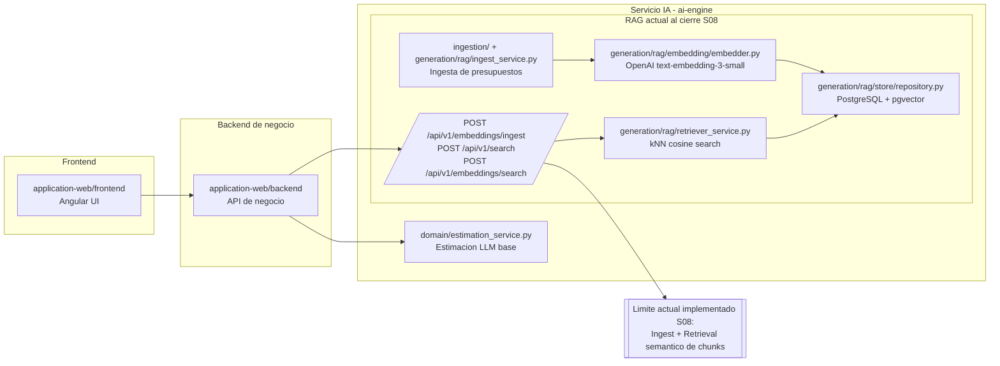

# Diagnostico Arquitectonico - Sesion 09 (pre-work)

## 1) Diagrama de la arquitectura actual



Estado observado: el sistema llega hasta vectorizar contenido y recuperar chunks similares. No existe un flujo conectado de transcripcion -> extraccion de requisitos -> estimacion generada y justificada con evidencia.

## 2) Trace anotado de una transcripcion

Transcripcion usada para el trace: `data/seed/transcripts/transcripcion_2025-02-03_betanorte.txt` (la mas cercana al caso ambiguo).

### 2.1 Preparacion del estado para poder trazar

Primero ejecute el sistema tal cual y documente los bloqueos reales:

1. `POST /api/v1/search` devolvia 500 porque la tabla `chunks` no existia.
2. Alembic no pudo migrar por revision faltante: `Can't locate revision identified by '001_add_tier_to_users'`.

Para desbloquear el trace operativo de S08 (sin implementar S09), cree las tablas RAG equivalentes a la migracion `0001` y luego ingeste los presupuestos seed.

Comandos ejecutados:

```bash
# Verificar tablas actuales

docker exec lidr-master-ai-engineering-postgres-1 psql -U estimator -d estimator -c "\\dt"

# Crear tablas RAG (documents/chunks + indexes + extension vector)
# (se aplico SQL equivalente a ai-engine/alembic/versions/0001_initial_schema.py)

# Ingestar presupuestos seed via endpoint existente

docker exec lidr-master-ai-engineering-ai-engine-1 python -c "
import os, json, urllib.request, pathlib
KEY = os.environ.get('INTERNAL_API_KEY','')
base='http://localhost:8001/api/v1/embeddings/ingest'
root=pathlib.Path('/app/data/seed/budgets')
files=sorted(root.glob('*.json'))
for i,f in enumerate(files,1):
    payload={'source_path': f'data/seed/budgets/{f.name}', 'document_type':'historical_budget', 'content': json.loads(f.read_text(encoding='utf-8'))}
    data=json.dumps(payload, ensure_ascii=False).encode('utf-8')
    req=urllib.request.Request(base, data=data, headers={'Content-Type':'application/json','X-Internal-API-Key':KEY}, method='POST')
    try:
        with urllib.request.urlopen(req, timeout=60) as r:
            body=r.read().decode('utf-8')
            print(f'[{i:02d}] {f.name}: HTTP {r.status} {body[:120]}')
    except urllib.error.HTTPError as e:
        body=e.read().decode('utf-8')
        print(f'[{i:02d}] {f.name}: HTTP {e.code} {body[:180]}')
"
```

Respuesta cruda relevante (resumen literal):

```text
[01] BUDGET-2024-0001.json: HTTP 200 {"document_id":1,"chunks_created":4,...}
[02] BUDGET-2024-0002.json: HTTP 200 {"document_id":2,"chunks_created":3,...}
[03] BUDGET-2024-0003.json: HTTP 200 {"document_id":3,"chunks_created":2,...}
[04] BUDGET-2024-0004.json: HTTP 200 {"document_id":4,"chunks_created":2,...}
[05] BUDGET-2024-0005-v1.json: HTTP 200 {"document_id":5,"chunks_created":2,...}
[06] BUDGET-2024-0005-v2.json: HTTP 200 {"document_id":6,"chunks_created":2,...}
[07] budgets_sample.json: HTTP 422 {"detail":[{"type":"dict_type",...}]}
```

Comentario: la ingesta principal funciona con los presupuestos historicos reales; el archivo `budgets_sample.json` no cumple el contrato de `content` esperado por `IngestPersistRequest`.

### 2.2 Paso 1 - Embedding de la transcripcion completa

Como el endpoint `POST /api/v1/embeddings/embedding-pipeline/embeddings` no esta montado en `app/main.py`, use el modulo de embeddings directamente (mismo modelo usado por retrieval).

Comando ejecutado (script reproducible):

```bash
docker cp ai-engine/scripts/trace_runner_s09.py lidr-master-ai-engineering-ai-engine-1:/tmp/trace_runner_s09.py

docker exec lidr-master-ai-engineering-ai-engine-1 python /tmp/trace_runner_s09.py
```

Respuesta cruda (seccion STEP1_EMBED):

```text
STEP1_EMBED
model=text-embedding-3-small
dims=1536
norm=0.99984514
first=[0.00604248, 0.07574463]
last=[0.03396606, -0.00097513]
```

Comentario: el vector representa la mezcla semantica de toda la conversacion (ERP, logistica, alcance, cumplimiento). La norma cercana a 1 es consistente con embeddings normalizados, por lo que la comparacion coseno es estable.

### 2.3 Paso 2 - Busqueda semantica top-5

Llamada ejecutada dentro del script anterior:

```text
POST http://localhost:8001/api/v1/search
payload = {"query": <transcripcion completa>, "k": 5}
```

Respuesta cruda:

```text
STEP2_SEARCH
search_time_ms=267
k=5
results=5
R1: chunk_id=5 doc_id=2 distance=0.538480
META1: {"year": 2024, "budget_id": "BUD-2024-002", "complexity": "medium", "component_id": "AUDIT-001", "client_sector": "distribution", "estimated_hours": 40, "main_technology": "java"}
CONTENT1: [Project: ERP migration from legacy system with three warehouse management] ... Component: Process Audit ...

R2: chunk_id=6 doc_id=2 distance=0.558623
META2: {"year": 2024, "budget_id": "BUD-2024-002", "complexity": "high", "component_id": "INTEG-001", "client_sector": "distribution", "estimated_hours": 160, "main_technology": "java"}
CONTENT2: [Project: ERP migration from legacy system with three warehouse management] ... Component: Backend Integrations ...

R3: chunk_id=7 doc_id=2 distance=0.596456
META3: {"year": 2024, "budget_id": "BUD-2024-002", "complexity": "medium", "component_id": "DASH-001", "client_sector": "distribution", "estimated_hours": 40, "main_technology": "java"}
CONTENT3: [Project: ERP migration from legacy system with three warehouse management] ... Component: Analytics Dashboards ...

R4: chunk_id=14 doc_id=6 distance=0.605517
META4: {"year": 2024, "budget_id": "BUD-2024-005", "complexity": "medium", "component_id": "DISC-005", "client_sector": "manufacturing", "estimated_hours": 40, "main_technology": "dotnet"}
CONTENT4: [Project: Manufacturing management system implementation with expanded scope] ... Component: Discovery Phase ...

R5: chunk_id=1 doc_id=1 distance=0.607628
META5: {"year": 2024, "budget_id": "BUD-2024-001", "complexity": "medium", "component_id": "DISC-001", "client_sector": "saas", "estimated_hours": 40, "main_technology": "nodejs"}
CONTENT5: [Project: B2B SaaS platform with Workday integration] ... Component: Discovery phase ...
```

### 2.4 Comentario por chunk devuelto

1. R1 (`BUD-2024-002`, sector distribution): muy relevante. Habla de migracion ERP y auditoria de procesos; coincide con el foco de integracion ERP y cambios de alcance.
2. R2 (`BUD-2024-002`, sector distribution): muy relevante. Es justo integraciones backend con ERP legacy.
3. R3 (`BUD-2024-002`, sector distribution): relevancia media. Sigue en ERP/distribucion, pero dashboards puede ser secundario respecto al problema principal.
4. R4 (`BUD-2024-005`, sector manufacturing): relevancia baja-media. Coincide en expansion de alcance, pero sector y stack ya se alejan.
5. R5 (`BUD-2024-001`, sector saas): relevancia baja. El match parece venir por similitud superficial de discovery/componentes, no por dominio.

## 3) Diagnostico - cinco fallos identificados

### Fallo 1
- Problema observado: la ruta de embedding esperada para el pipeline (`/api/v1/embeddings/embedding-pipeline/embeddings`) devuelve 404; el trace tuvo que invocar el modulo Python directamente.
- Causa probable: en `app/api/embeddings.py` hay dos routers, pero en `app/main.py` solo se monta `ingest_router`, no `router` (que contiene `build_embeddings` y `build_chunks`).
- Propuesta de solucion: consolidar y publicar una API unica de Query Encoding para RAG (endpoint estable y documentado), y usarla en Retrieval.

### Fallo 2
- Problema observado: `POST /api/v1/search` devolvia 500 con `UndefinedTableError: relation "chunks" does not exist`.
- Causa probable: drift de migraciones/estado de BD (revision alembic inconsistente) y falta de bootstrap robusto para tablas RAG.
- Propuesta de solucion: pipeline de migracion unificado y verificable en startup/CI (healthcheck de schema + fail fast con error claro).

### Fallo 3
- Problema observado: aunque top-3 es bueno, los scores se comprimen entre ~0.54 y ~0.61 y aparecen chunks poco pertinentes (SaaS/discovery) en top-5.
- Causa probable: query embedding de transcripcion completa sin desambiguacion ni extraccion de intentos; ruido de nombres, correos, metadatos conversacionales.
- Propuesta de solucion: etapa previa de `Query Understanding` (limpieza, extraccion de requisitos/constraints, query rewriting y multi-query retrieval).

### Fallo 4
- Problema observado: el sistema se queda en retrieval de chunks; no produce una estimacion final basada en evidencia recuperada.
- Causa probable: falta de las etapas de Augmentation + Generation conectadas al flujo de transcripciones (no existe orquestador end-to-end Query->Retrieve->Generate).
- Propuesta de solucion: introducir un `RAG Orchestrator` con context builder y generador de estimaciones estructuradas con citas a chunks.

### Fallo 5
- Problema observado: la ingesta de `budgets_sample.json` falla con 422 por contrato de `content`, mientras otros budgets entran bien.
- Causa probable: formato de entrada heterogeneo y validacion estricta sin normalizacion previa.
- Propuesta de solucion: capa de normalizacion/adapter en ingest para soportar variantes de schema y emitir errores de dominio accionables.

## 4) Propuesta de evolucion arquitectonica

```mermaid
flowchart LR
  subgraph FE[Frontend]
    WEB[application-web/frontend]
  end

  subgraph BE[Backend de negocio]
    APIB[application-web/backend]
  end

  subgraph AI[Servicio IA - ai-engine (propuesto)]
    QEP[NEW: Query Entry Point\nPOST /api/v1/rag/estimate-from-transcript]
    PRE[NEW: Transcript Preprocessor\nclean + pii redact + speaker turns]
    REQ[NEW: Requirements Extractor\nscope, constraints, risks, assumptions]
    QRY[NEW: Query Rewriter\ncanonical query + subqueries]
    RET[EXISTING: Semantic Retriever\npgvector search]
    RER[NEW: Re-ranker\nre-score topN by intent fit]
    AUG[NEW: Context Builder\nselected chunks + rationale + gaps]
    GEN[NEW: Estimation Generator\nstructured output + citations]
    VAL[NEW: Estimation Validator\nconsistency + bounds + missing data]
    OUT[NEW: Estimation Response\nJSON + markdown justification]

    STO[(EXISTING: pgvector store\ndocuments/chunks)]

    QEP --> PRE --> REQ --> QRY --> RET --> RER --> AUG --> GEN --> VAL --> OUT
    RET --> STO
  end

  WEB --> APIB --> QEP
```

Responsabilidad y flujo de datos (resumen): `Transcript Preprocessor` limpia la transcripcion y separa ruido; `Requirements Extractor` produce una representacion estructurada del pedido; `Query Rewriter` genera consultas de retrieval mas discriminativas; `Retriever + Re-ranker` recuperan y priorizan evidencia historica; `Context Builder` empaqueta evidencia y huecos; `Estimation Generator` emite estimacion trazable; `Validator` asegura coherencia y marca incertidumbre antes de responder. Si solo pudiera construir una pieza primero, atacaria `Requirements Extractor`, porque hoy el mayor cuello de botella es la mala representacion de la consulta (transcripcion cruda) que contamina todo lo que viene despues.
