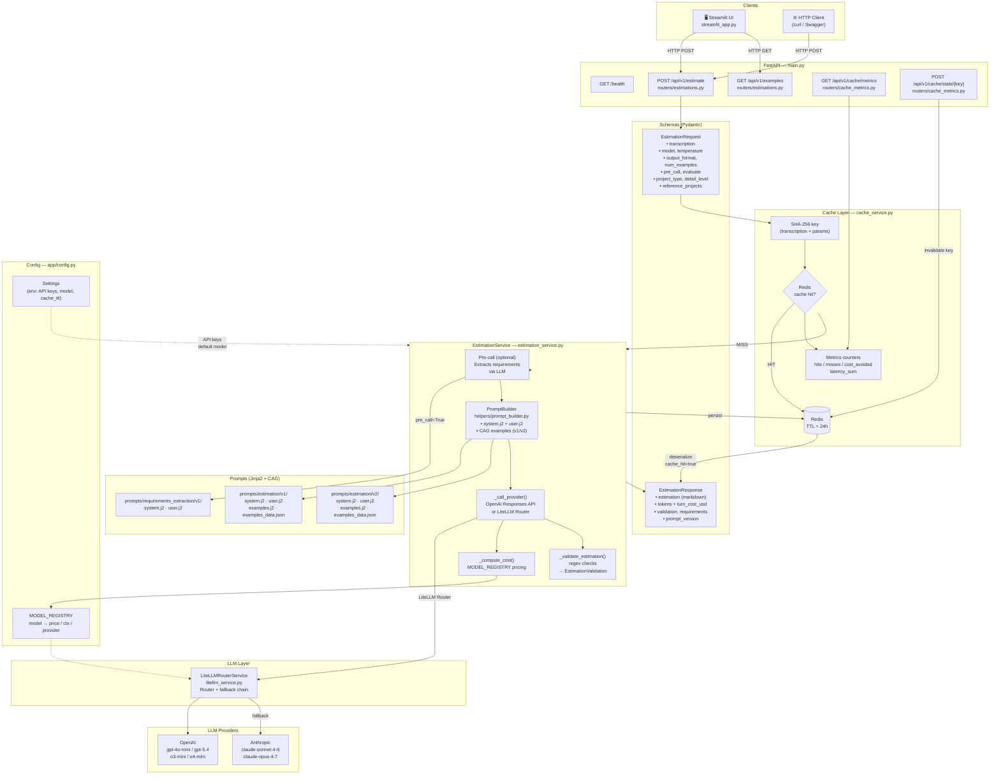

# estimator-cag

REST API that generates software effort estimates from meeting transcriptions. It implements a **Context-Augmented Generation (CAG)** approach: curated reference examples are injected into the system prompt so the model always produces structured, consistent estimates.

## Architecture

### Data flow diagram



### How it works

Every `POST /api/v1/estimate` request flows through three layers:

1. **Cache layer** (`cache_service.py`) — A SHA-256 hash of all request parameters is computed. If a matching key exists in Redis the response is returned immediately with `cache_hit=true` and zero LLM cost. On a miss, the request continues and the final response is stored in Redis with a 24-hour TTL. Hit/miss counters, cost-avoided totals, and latency averages are tracked as Redis counters and exposed via `GET /api/v1/cache/metrics`.

2. **Estimation service** (`estimation_service.py`) — Orchestrates the full pipeline:
   - *(Optional)* A **pre-call** (`pre_call=true`) sends the raw transcription through a requirements-extraction prompt to produce a cleaner, structured input before the main call.
   - **`PromptBuilder`** renders the Jinja2 system and user templates (v1 or v2) and injects the configured number of CAG few-shot examples.
   - **`_call_provider()`** dispatches all requests through `LiteLLMRouterService` (`litellm_service.py`), which uses a LiteLLM Router with a primary OpenAI model and an automatic Anthropic fallback chain.
   - **`_compute_cost()`** calculates the USD cost from `MODEL_REGISTRY` pricing.
   - *(Optional)* **`_validate_estimation()`** runs regex checks on the output and returns a structured `EstimationValidation` score.

3. **LLM layer** (`llm/openai.py`, `llm/litellm.py`) — Thin provider wrappers that normalize the response format (text, input/output tokens, response ID) for the service layer. The LiteLLM router supports a primary model with a configurable fallback chain.

All supported models and their pricing are declared in `MODEL_REGISTRY` inside `app/config.py` — a single source of truth used by both the API and the Streamlit UI.

## Features

- **CAG pipeline** — static estimation examples in the system prompt; the model always returns a coherent, structured output.
- **Typed responses** — every estimation is returned as a validated `EstimationResult` object (phases, costs, duration, confidence).
- **Multi-provider support** — OpenAI and Anthropic via LiteLLM; switch models per-request without restarting the server.
- **Redis cache** — identical requests are served from cache without calling the LLM.
- **Token and cost tracking** — every response includes input/output token counts and per-turn USD cost.
- **Streamlit UI** — web interface to paste transcriptions and receive structured estimates without writing code.

## Project structure

```
estimator-cag/
├── app/
│   ├── config.py                         # Settings + MODEL_REGISTRY
│   ├── routers/
│   │   ├── estimations.py                # POST /estimate, GET /examples
│   │   └── cache_metrics.py             # GET /cache/metrics, POST /cache/stale
│   ├── services/
│   │   ├── estimation_service.py         # Main orchestration + cost calc
│   │   ├── cache_service.py              # Redis caching decorator
│   │   ├── litellm_service.py            # LiteLLM Router + fallback chain
│   │   └── helpers/
│   │       ├── prompt_builder.py         # Jinja2 template renderer
│   │       └── error_mapper.py           # LLM error normalisation
│   ├── schemas/
│   │   └── estimation.py                 # EstimationRequest / EstimationResponse
│   └── prompts/
│       ├── estimation/v1/                # system.j2, user.j2, examples (v1)
│       ├── estimation/v2/                # system.j2, user.j2, examples (v2)
│       └── requirements_extraction/v1/   # pre-call prompt templates
├── tests/                                # Unit and integration tests
├── streamlit_app.py                      # Streamlit UI entry point
├── docker-compose.yml                    # API + Redis
├── main.py                               # Uvicorn entry point
└── pyproject.toml
```

## API

| Method | Path | Description |
|--------|------|-------------|
| `GET` | `/health` | Health check |
| `GET` | `/api/v1/examples` | Returns the CAG reference examples loaded into the prompt |
| `POST` | `/api/v1/estimate` | Generates a structured effort estimate |

### `POST /api/v1/estimate`

**Request body**

```json
{
  "transcription": "<meeting transcription or project description>",
  "model": "gpt-4o-mini",
  "temperature": 0.7,
  "max_output_tokens": 2048
}
```

**Response body**

```json
{
  "result": {
    "summary": "Mobile app with authentication and dashboard",
    "total_duration_weeks": 10,
    "total_cost_eur": 28000,
    "confidence_pct": 80,
    "phases": [
      {
        "name": "Design & Architecture",
        "duration_weeks": 2,
        "cost_eur": 5000,
        "confidence_pct": 90,
        "assumptions": ["Figma mockups provided"]
      }
    ]
  },
  "model": "gpt-4o-mini",
  "input_tokens": 620,
  "output_tokens": 310,
  "turn_cost_usd": 0.000279,
  "response_id": "chatcmpl-...",
  "prompt_version": "v1"
}
```

**Error responses**

| Status | Condition |
|--------|-----------|
| `401` | Invalid or missing API key |
| `413` | Estimated prompt exceeds the model context window |
| `422` | `transcription` field missing or too short |
| `429` | LLM provider rate limit exceeded |
| `500` | LLM provider returned an unexpected error |

## Setup

### 1. Configure environment variables

Create a `.env` file inside `estimator-cag/`:

```env
OPENAI_API_KEY=sk-...
# ANTHROPIC_API_KEY=sk-ant-...   # uncomment to enable Anthropic models

# Default model (must be a key in MODEL_REGISTRY)
LLM_MODEL=gpt-4o-mini

# Redis cache (optional)
CACHE_ENABLED=false
```

### 2. Run with Docker Compose

```bash
cd estimator-cag
docker compose up --build
```

This starts the FastAPI backend and a Redis container.

- **API + interactive docs**: http://localhost:8000/docs

### 3. Run the Streamlit UI locally

Streamlit runs outside Docker to avoid WebSocket issues with Docker Desktop on Windows.

Requires Python 3.11+ and [uv](https://docs.astral.sh/uv/).

```bash
cd estimator-cag
uv sync
uv run streamlit run streamlit_app.py        # UI at http://localhost:8501
```

### Local execution (without Docker)

```bash
cd estimator-cag
uv sync
uv run python main.py                        # API at http://localhost:8000
uv run streamlit run streamlit_app.py        # UI  at http://localhost:8501
```

## Adding or updating models

All supported models are declared in `app/config.py`:

```python
MODEL_REGISTRY: dict[str, ModelConfig] = {
    # OpenAI
    "gpt-4o-mini":        ModelConfig("gpt-4o-mini",        0.15,  0.60, 128_000, "openai"),
    "gpt-5.4-mini":       ModelConfig("gpt-5.4-mini",       0.75,  4.50, 128_000, "openai"),
    "gpt-5.4":            ModelConfig("gpt-5.4",            2.50, 15.00, 128_000, "openai"),
    "o3-mini":            ModelConfig("o3-mini",             1.10,  4.40, 200_000, "openai", reasoning=True),
    "o4-mini":            ModelConfig("o4-mini",             1.10,  4.40, 200_000, "openai", reasoning=True),
    # Anthropic — litellm_model must include the "anthropic/" prefix
    "claude-sonnet-4-6":  ModelConfig("anthropic/claude-sonnet-4-6",  3.00, 15.00, 200_000, "anthropic"),
    "claude-opus-4-7":    ModelConfig("anthropic/claude-opus-4-7",   15.00, 75.00, 200_000, "anthropic", reasoning=True),
    # ...
}
```

Each entry specifies the LiteLLM model string, input/output price per million tokens, context window, provider, and whether the model supports reasoning. Adding a new model requires only one line here — the API and UI pick it up automatically.

## Design decisions

### Session metadata extraction: heuristic vs. LLM extractor

After each estimation turn the service enriches a `ProjectMetadata` object
(project name, tech stack, team size, agreed scope) that is injected into the
`<project_metadata>` block of the system prompt on every subsequent call.

Two strategies were considered for populating this object:

| | Heuristic | LLM extractor |
|---|---|---|
| **Latency overhead** | < 1 ms (regex, no I/O) | +0.5–1 s per turn |
| **Cost overhead** | zero | one extra LLM call per turn |
| **Accuracy** | good for narrow, well-defined fields | better for ambiguous names/scope |
| **Failure mode** | field stays `None` silently | API error blocks the turn |

**Decision: heuristic** (`app/services/metadata_extractor.py`).

The fields are narrow and predictable enough for a regex/allow-list approach:
`project_name` is matched by title-phrase patterns; `mentioned_technologies` is
scanned against a curated ~70-keyword allow-list; `assumed_team_size` is extracted
from numeric patterns in the LLM response; `agreed_scope` is the first sentence(s)
of the transcript. False positives are low-risk — the metadata is advisory context
for the LLM, not user-facing output. The `MetadataExtractor.update()` interface is
stable, so a `LLMMetadataExtractor` can be swapped in without touching the router.

## Tests

```bash
uv run pytest tests/ -v
```
